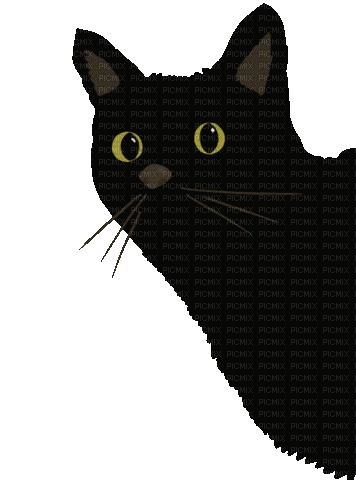

<h2 align="left">Hi There👋! I'm Xiaojing(Kay) Xu,a Full-Stack Developer,  📠San Francisco, Bay Area, CA</h2>

###

📠:  Master’s Degree from NYU, Exchange Program at UC Berkeley, Certificate from San Jose State University.  📊 Experience: 6+ years as a Market Data Analyst, Working with Python, SQL, and Data Visualization.  ✨ Fun Facts: Tarot Enthusiast, Photography Lover   🯠I am Actively Looking for a FULL-TIME Position as a Full-Stack Developer.

###

  
  
  
  
  
  
  
  
  
  
  
  
  
  
  
  
  
  
  

###

  
  

###

###

  
  

###

 

###
